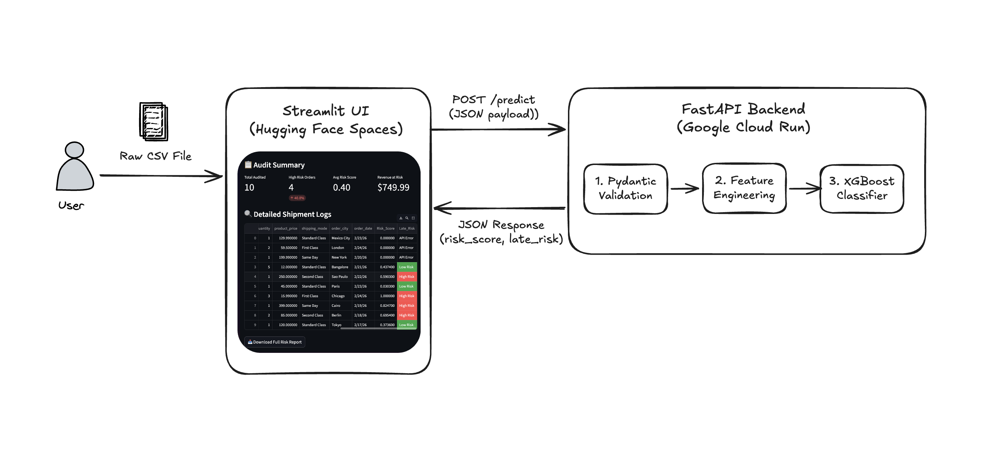

# 🚚 LogiRisk AI: End-to-End Supply Chain Risk Auditor

**Live Demo:** [Go to LiveDemo](https://huggingface.co/spaces/kaungsithu-sallius/logistics-risk-auditor)

**API Documentation:** [Google API Link](https://logirisk-api-716133749292.us-central1.run.app/predict)

## 🖼️ System Diagram

## 🎯 Business Problem
Logistics managers often struggle to identify which shipments are likely to be delayed in a high-volume environment. This project provides a **Decision Support System** that audits raw shipment logs to identify "Revenue at Risk" in seconds.

## 🏗️ System Architecture
The system follows a modern, decoupled microservices architecture:

1. **Frontend (Streamlit):** Hosted on **Hugging Face Spaces**. Provides a bulk CSV upload interface and an executive dashboard.
2. **Backend (FastAPI):** Dockerized and deployed on **Google Cloud Run**.
3. **Validation (Pydantic):** Ensures data integrity at the API entry point.
4. **Logic (Python):** Automated feature engineering (Urgency Scores, Temporal analysis) happens on-the-fly inside the API.
5. **Model (XGBoost):** A pre-trained classifier with **77% accuracy**.

## 🛠️ Tech Stack
- **Machine Learning:** Python, Scikit-learn, XGBoost, Pandas.
- **API Framework:** FastAPI, Uvicorn, Pydantic.
- **Frontend:** Streamlit.
- **DevOps/Cloud:** Docker, Google Cloud Run (GCR), Hugging Face Spaces.

## 📊 Key Features
- **Bulk Auditing:** Process 1,000+ rows via CSV upload.
- **Feature Engineering:** Automatically calculates `urgency_score` ($days \div quantity$) and extracts temporal features from raw dates.
- **Executive Summary:** Real-time calculation of "Revenue at Risk" and "Average Risk Score".

## 🚀 How to Run Locally
1. Clone the repository.
2. Install dependencies: `pip install -r requirements.txt`.
3. Start the API: `uvicorn app.main:app --reload`.
4. Start the UI: `streamlit run ui.py`.